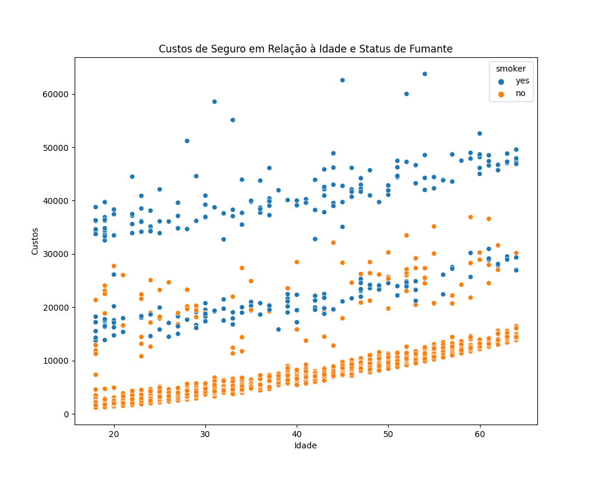

# Análise de Seguros com Python

Este projeto consiste em uma análise exploratória dos dados de um conjunto de pacientes e seus respectivos custos de seguro. O objetivo é identificar as relações entre as variáveis presentes nos dados, como idade, gênero, região e se o paciente é fumante. Os gráficos gerados a partir dessas variáveis são visualizados e analisados para obter insights.

## Dependências

Para executar este projeto, instale as seguintes bibliotecas:

pip install pandas matplotlib seaborn

## Conjunto de Dados

O conjunto de dados utilizado contém informações sobre pacientes e seus custos de seguro. As variáveis presentes no conjunto de dados são:

- age: idade do paciente
- sex: sexo do paciente
- bmi: índice de massa corporal
- children: número de filhos do paciente
- smoker: se o paciente é fumante ou não
- region: região do paciente
- charges: custos do seguro

## Análise Exploratória

Foram realizados diversos gráficos utilizando as funções definidas no código para explorar as variáveis do conjunto de dados:

### Distribuição da Idade dos Pacientes

### Custos de Seguro para Fumantes e Não Fumantes

### Custos de Seguro em Relação à Idade e Status de Fumante

### Distribuição de Indivíduos por Região

### Distribuição da Idade dos Pacientes com Pelo Menos Um Filho

### Distribuição de Sex

### Distribuição de Fumantes

### Distribuição de Região

